# BookVerse

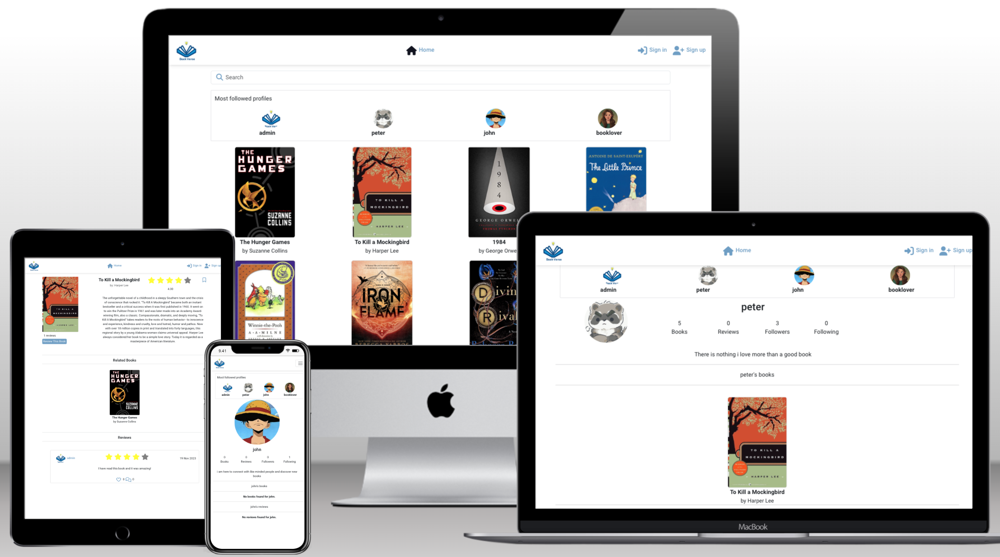

BookVerse is a website for book lovers. A place where users can share and discover new books and connect with fellow readers. Users can add books, rate them using a 5-star system, write their opinion about the book, save their favorite reads, and engage with the community by commenting and liking on reviews. The website is designed to be accessible on both desktop and mobile devices.

While browsing is open to all, active participation, such as adding books, writing reviews, requires a user account. BookVerse aims to create a space for literary enthusiasts to share opinions and connect with fellow readers.

Live website: [BookVerse](https://book-verse-4f0fa583e0ff.herokuapp.com/)

## User Experience

When designing this application, the main goal was to make it work well and be easy to understand. I chose to keep things simple and clear. Colors are used to draw attention to important stuff, like buttons or active parts of the navigation bar.

The design focuses on being straightforward, so users can easily find and use the app's features without confusion. I made an effort for it to work smoothly on large screens as well as on mobile devices. So, the design is friendly to different screen sizes.

In a nutshell, the design is about making everything work smoothly, being easy to understand, and looking good without being too complicated. Colors are used to help users, and the design works well on both computers and phones.

### User Stories

- As a user I want to to create an account so that I can access all the functionalities of the Bookverse web application
- As a user I want to to log in and log out of the Bookverse so that I can access my account and protect my privacy
- As a user I want to be able to add books to the Bookverse so that I can contribute to the collection of books available for review
- As a user I want to to be able to edit book details so that I can ensure the information remains accurate and correct them if necessary
- As a user I want to be able to delete books I've added so that I can manage the content I contribute on the platform
- As a user I want to see reviews ordered by most recent so that I can stay updated with the latest content and discussions
- As a user I want to see the book's average rating so that I can get an idea of its general popularity and quality
- As a user I want to to be able to see reviews and ratings from other users so that I can get their perspectives on a book
- As a user I want to be able to rate books so that I can provide a quick overall assessment
- As a user I want to write reviews for books I've read so that I can share my thoughts with the community
- As a user I want to be able to search for books so that I can quickly find books that I want to review
- As a user I want to delete reviews so that I can manage the content I contribute on the platform
- As a user I want to edit my reviews so that I can ensure that they are accurate
- As a user I want to comment on the reviews of other users so that I can engage in discussions and share my thoughts
- As a user I want to be able to like a review so that can show my appreciation or agreement with the content shared by others
- As a user I want to save books so that I can easily access and review them at a more convenient time
- As a user I want to have a navigation bar so that I can easily access different sections and features of the web application from any page
- As a user I want to see books related to the one I'm currently viewing so that I can explore similar content that aligns with my interests
- As a user I want to be able to view and follow other user's profile pages so that I can connect with like-minded readers
- As a user I want to see statistics on a user’s profile, like how many followers and people they follow, the count of books and reviews they have shared so that I can understand their activity on the website
- As a user I want to have the ability to add a short bio or description on my profile page so that I can introduce myself to the Bookverse community
- As a user I want to have a profile page that displays my account information so that I can view all my account informations
- As a user I want the book review website to have an infinite scroll feature so that I can continuously discover and browse through a vast collection of book reviews without having to click through pagination
- As a user I want to filter books by various criteria so that I can find specific content that interests me
- As a user I want to be able to edit and delete my comments on book reviews so that I can manage my contributions within the discussions
- As a user I want to the Bookverse's design to be visually appealing and intuitive so that I enjoy using it and find it easy to navigate
- As a user I want to the website to have a responsive design so that I can access it and use its features on different devices, such as desktops, tablets, and smartphones
- As a user I want to the website to have clear and informative error messages so that I can quickly identify and rectify any mistakes or issues

### Colour Scheme

I used [Coolors.co](https://coolors.co/) to genareta the following color palette:

### Typography 

I used Google Fonts for the following font:

- Roboto

### Wireframes

Wireframes were created using [Balsamiq](https://balsamiq.com/wireframes).

The initial wireframes provided a basic layout, but as development progressed, changes were made, new pages were added, and some features were removed and postponed for future implementation.

Home Page

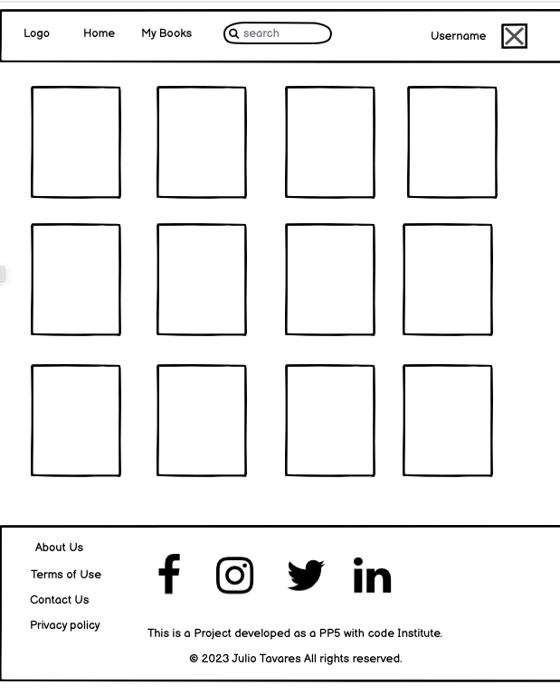

sign In

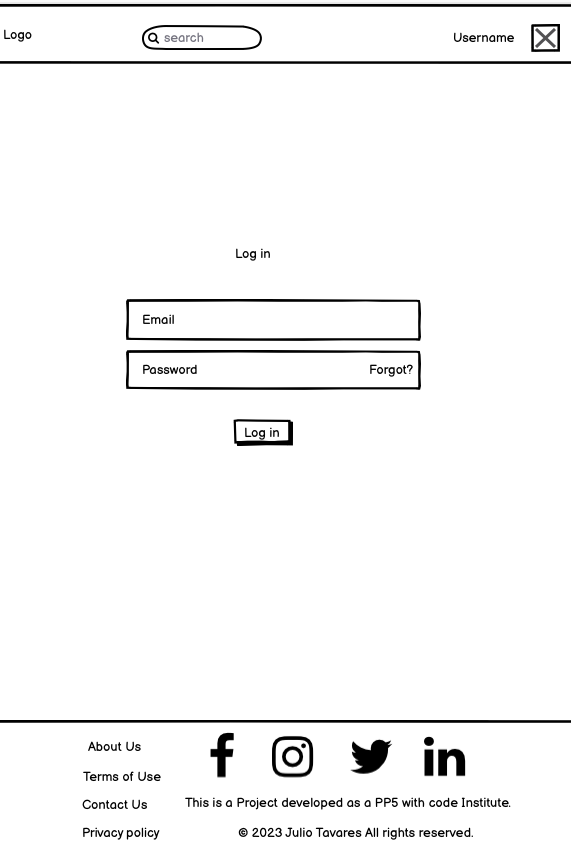

sign Up

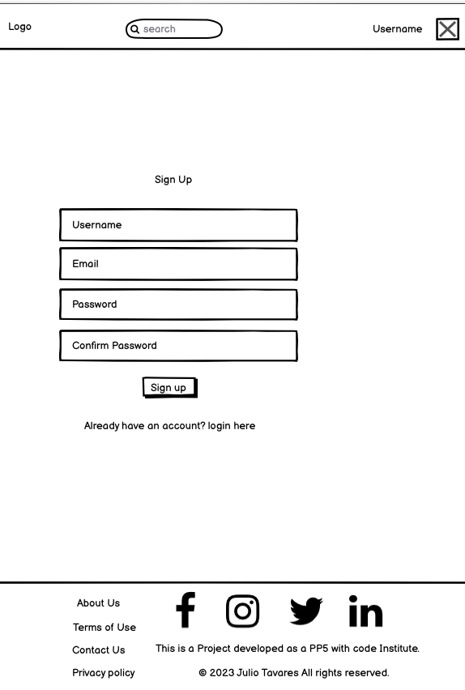

Book Create Page

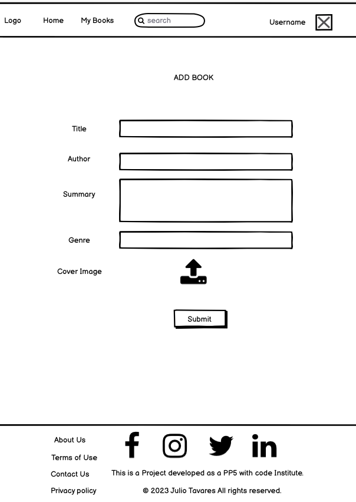

Book Page

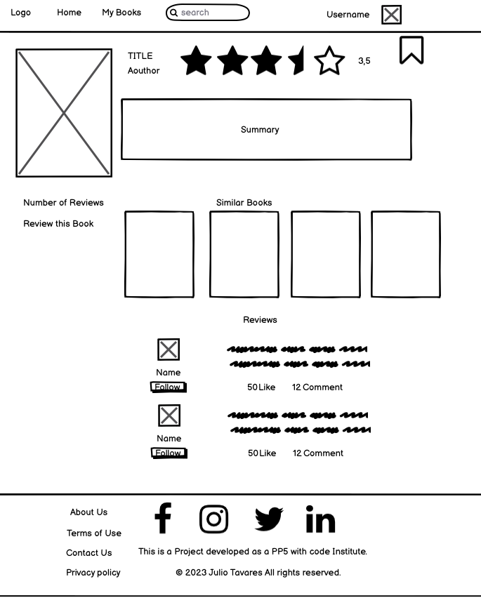

My Books

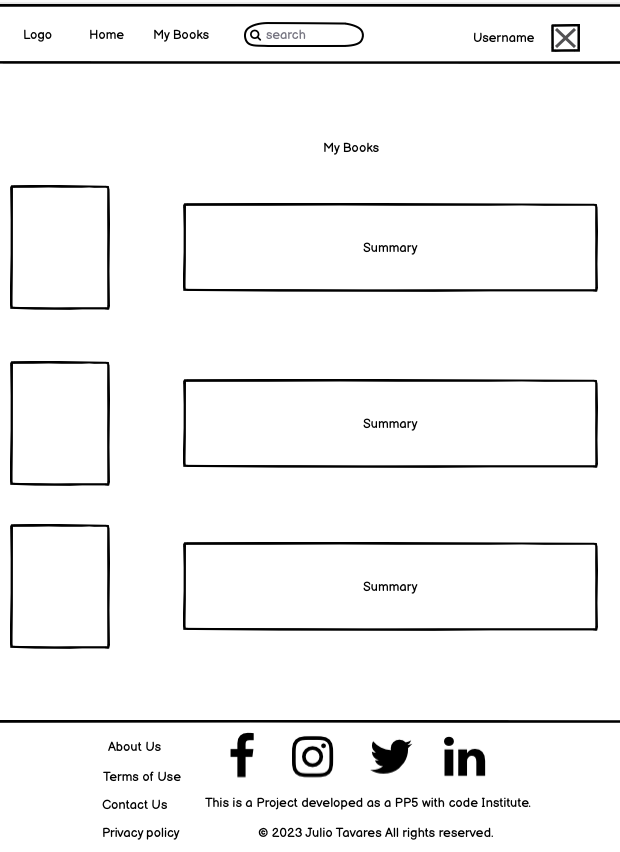

Profile Page

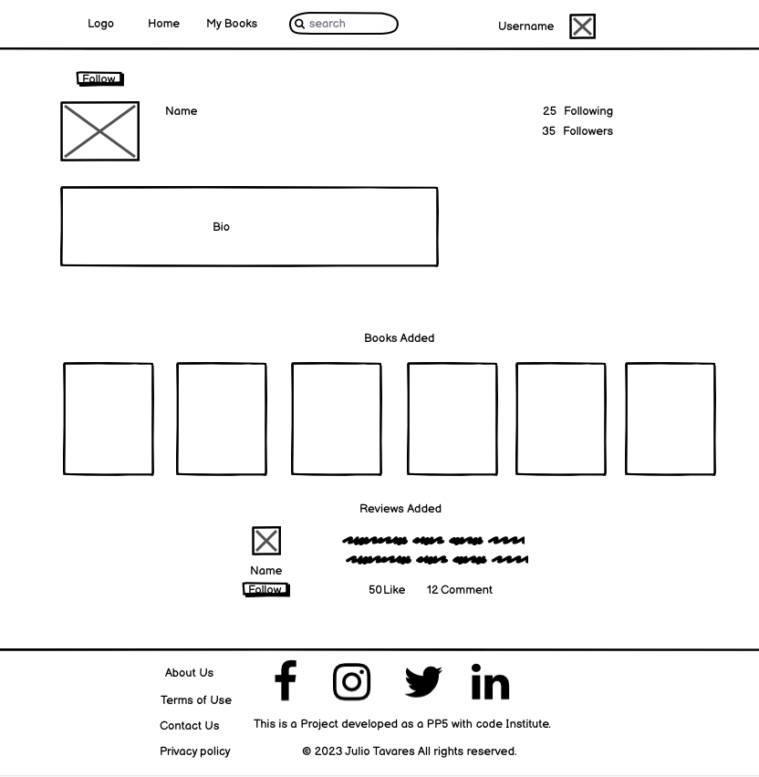

Review Create Page

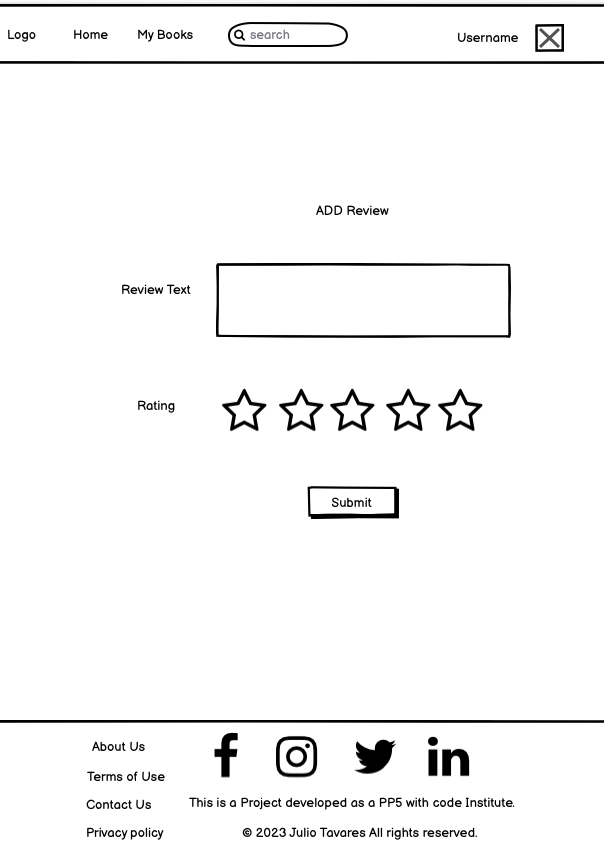

### Database Scheme

The Database was created using [Lucid Chart](https://www.lucidchart.com/). It consists of 8 models: Book, Review,
Comment, Like, Saved Book, Follow, Profile and the built in User model. 

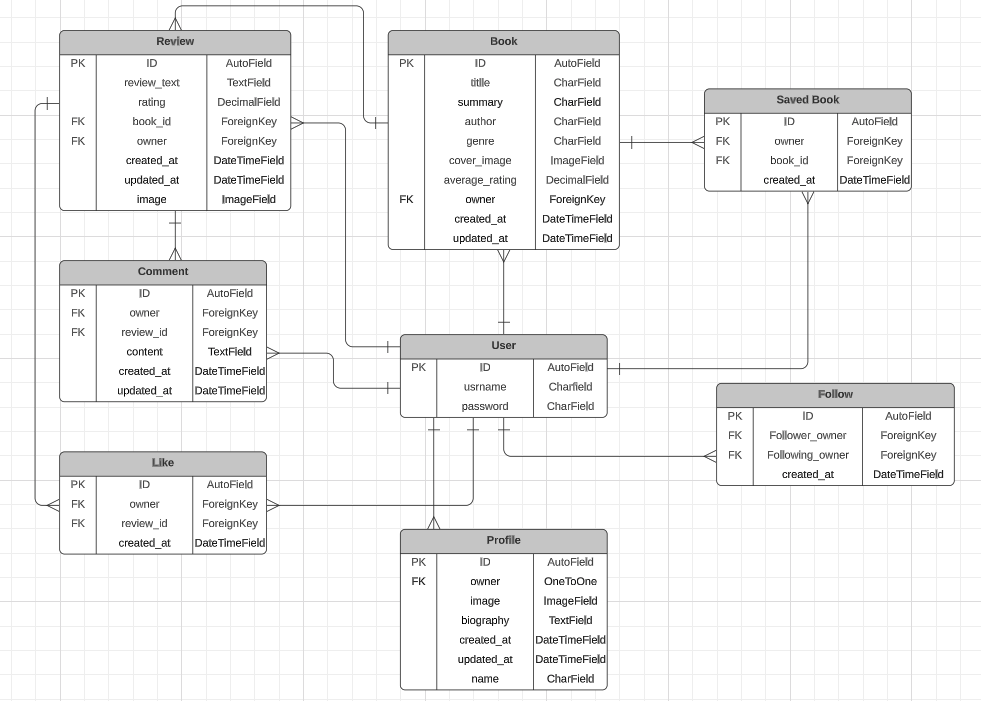

## Agile Development 

This project was developed using agile development principles.

I used [GitHub Project](https://github.com/users/jmanager25/projects/4/views/1) as an agile tool to manage the project's
progress using agile principles. With GitHub Issues, I created epics and user stories and each user stories included acceptance criterias, 
to determine when that user story was completed successfully. I also defined tasks within the user stories, defining specific actions i needed
to take to fulfill the acceptance criteria.

To prioritize the work effectively, I used MOSCOW prioritization. These allowed me to categorize issues into four main groups: 
"must have" features that were critical for the project, "could have" features that were desirable but not essential, 
"should have" features that had moderate importance, and "won't have" features that were intentionally excluded.

To maintain a clear project structure, I linked related issues to their corresponding epics. This provided a high-level view of the project's progress and helped me stay organized throughout the development process.

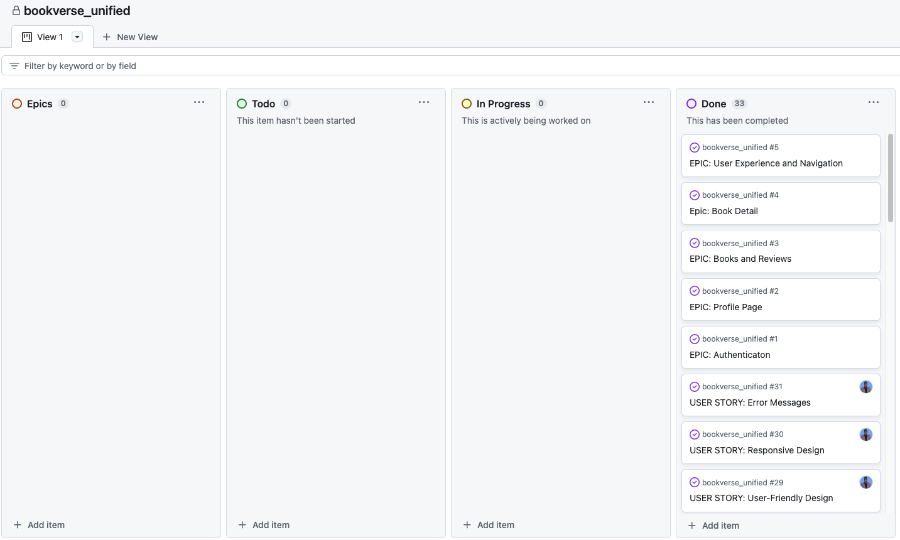
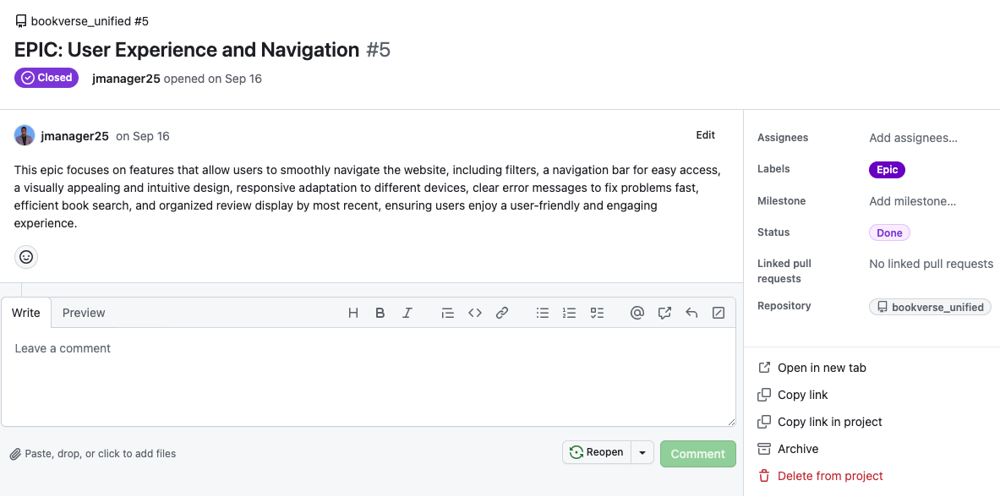
