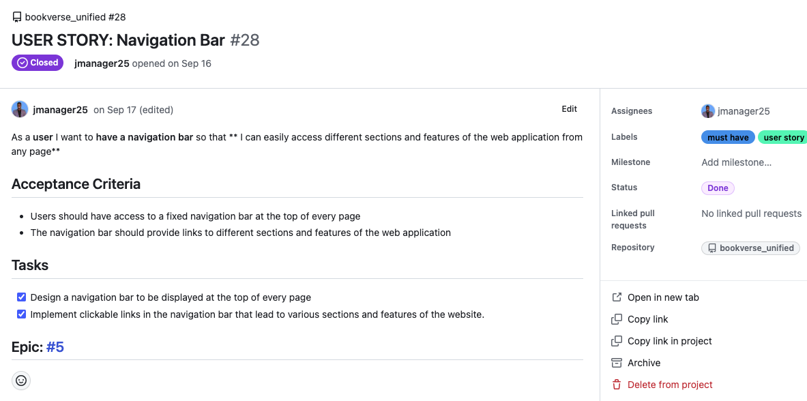

# BookVerse

BookVerse is a website for book lovers. A place where users can share and discover new books and connect with fellow readers. Users can add books, rate them using a 5-star system, write their opinion about the book, save their favorite reads, and engage with the community by commenting and liking on reviews. The website is designed to be accessible on both desktop and mobile devices.

While browsing is open to all, active participation, such as adding books, writing reviews, requires a user account. BookVerse aims to create a space for literary enthusiasts to share opinions and connect with fellow readers.

Live website: [BookVerse](https://book-verse-4f0fa583e0ff.herokuapp.com/)

## User Experience

When designing this application, the main goal was to make it work well and be easy to understand. I chose to keep things simple and clear. Colors are used to draw attention to important stuff, like buttons or active parts of the navigation bar.

The design focuses on being straightforward, so users can easily find and use the app's features without confusion. I made an effort for it to work smoothly on large screens as well as on mobile devices. So, the design is friendly to different screen sizes.

In a nutshell, the design is about making everything work smoothly, being easy to understand, and looking good without being too complicated. Colors are used to help users, and the design works well on both computers and phones.

### User Stories

- As a user I want to to create an account so that I can access all the functionalities of the Bookverse web application
- As a user I want to to log in and log out of the Bookverse so that I can access my account and protect my privacy
- As a user I want to be able to add books to the Bookverse so that I can contribute to the collection of books available for review
- As a user I want to to be able to edit book details so that I can ensure the information remains accurate and correct them if necessary
- As a user I want to be able to delete books I've added so that I can manage the content I contribute on the platform
- As a user I want to see reviews ordered by most recent so that I can stay updated with the latest content and discussions
- As a user I want to see the book's average rating so that I can get an idea of its general popularity and quality
- As a user I want to to be able to see reviews and ratings from other users so that I can get their perspectives on a book
- As a user I want to be able to rate books so that I can provide a quick overall assessment
- As a user I want to write reviews for books I've read so that I can share my thoughts with the community
- As a user I want to be able to search for books so that I can quickly find books that I want to review
- As a user I want to delete reviews so that I can manage the content I contribute on the platform
- As a user I want to edit my reviews so that I can ensure that they are accurate
- As a user I want to comment on the reviews of other users so that I can engage in discussions and share my thoughts
- As a user I want to be able to like a review so that can show my appreciation or agreement with the content shared by others
- As a user I want to save books so that I can easily access and review them at a more convenient time
- As a user I want to have a navigation bar so that I can easily access different sections and features of the web application from any page
- As a user I want to see books related to the one I'm currently viewing so that I can explore similar content that aligns with my interests
- As a user I want to be able to view and follow other user's profile pages so that I can connect with like-minded readers
- As a user I want to see statistics on a user’s profile, like how many followers and people they follow, the count of books and reviews they have shared so that I can understand their activity on the website
- As a user I want to have the ability to add a short bio or description on my profile page so that I can introduce myself to the Bookverse community
- As a user I want to have a profile page that displays my account information so that I can view all my account informations
- As a user I want the book review website to have an infinite scroll feature so that I can continuously discover and browse through a vast collection of book reviews without having to click through pagination
- As a user I want to filter books by various criteria so that I can find specific content that interests me
- As a user I want to be able to edit and delete my comments on book reviews so that I can manage my contributions within the discussions
- As a user I want to the Bookverse's design to be visually appealing and intuitive so that I enjoy using it and find it easy to navigate
- As a user I want to the website to have a responsive design so that I can access it and use its features on different devices, such as desktops, tablets, and smartphones
- As a user I want to the website to have clear and informative error messages so that I can quickly identify and rectify any mistakes or issues

### Colour Scheme

I used [Coolors.co](https://coolors.co/) to genareta the following color palette:

### Typography 

I used Google Fonts for the following font:

- Roboto

### Wireframes

Wireframes were created using [Balsamiq](https://balsamiq.com/wireframes).

The initial wireframes provided a basic layout, but as development progressed, changes were made, new pages were added, and some features were removed and postponed for future implementation.

Home Page

sign In

sign Up

Book Create Page

Book Page

My Books

Profile Page

Review Create Page

### Database Scheme

The Database was created using [Lucid Chart](https://www.lucidchart.com/). It consists of 8 models: Book, Review,
Comment, Like, Saved Book, Follow, Profile and the built in User model. 

## Agile Development 

This project was developed using agile development principles.

I used [GitHub Project](https://github.com/users/jmanager25/projects/4/views/1) as an agile tool to manage the project's
progress using agile principles. With GitHub Issues, I created epics and user stories and each user stories included acceptance criterias, 
to determine when that user story was completed successfully. I also defined tasks within the user stories, defining specific actions i needed
to take to fulfill the acceptance criteria.

To prioritize the work effectively, I used MOSCOW prioritization. These allowed me to categorize issues into four main groups: 
"must have" features that were critical for the project, "could have" features that were desirable but not essential, 
"should have" features that had moderate importance, and "won't have" features that were intentionally excluded.

To maintain a clear project structure, I linked related issues to their corresponding epics. This provided a high-level view of the project's progress and helped me stay organized throughout the development process.

## Features 

### Existing Features

#### Sign Up

The sign up page enables users to register by providing the username, password, and confirm password.

#### Sign In

The login page enables users to access their account by entering their username and password.

#### Home Page 

The home page, or landing page, is the first thing users see when they visit the website. On this page, users will find a long list of books that they can explore. If a user is the owner of the book, he will also see bellow the books the icons to edit or delete the respective book. 

#### Navbar 

The navbar is like a helpful guide that stays with users on every page of the website. It holds the company's logo, a link to add a book (where users can share their books), links to the home page and their book collection, the username and avatar of the logged-in user, and a sign-out button for logging out of the account. It's a handy navigation tool always ready at the top of the screen.

#### Search Bar

The search bar is a helpful tool for the users. It allows them to search for a specific book using various clues like the book title, author's name, genre, or even the name of the user who added the book. It's a handy feature to quickly find what you're looking for on the website.

#### Add Books Form

The "Add Books" form is where users fill in information about the books they want to add. They need to fill in details like the title, author, genre, a summary of the book, and even attach a cover image. All these fields are necessary, making sure users provide comprehensive information about the book they're adding to the website.

#### Book Page 

When users click on a book, they're taken to this page where they can find everything about it. This includes the cover image, title, author name, any ratings given by users, an icon to save the book, a summary or description of the book, the count of reviews it has, and a link to add their own review. The page also suggests related books (those with the same genre) and displays all the reviews that users have written about that specific book. It's a comprehensive space for users to explore and engage with the book's details and community reviews.

#### Reviews 

The review feature is a key element of the website, offering users a closer look at what others think about a book. Each review showcases the user's avatar and username, the given rating, the date of the review, the review content, a button to express approval by liking, and a comment form for further discussion. Users can also see the count of likes and comments a review has received. If the reviewer is also the owner, they'll find three dots that, when clicked, reveal options like editing or deleting the review in a convenient dropdown menu.

#### Comments 

Comments are positioned below their corresponding reviews, providing additional insights into user discussions. Each comment features the user's avatar, username, and the date it was last updated, along with the comment content. For the comment owner, a convenient three-dot icon at the bottom-right opens a dropdown menu offering options to either edit or delete the comment.

#### Add Review Form 

The "Add Review" form is the space where users can share their thoughts and opinions about a book. It consists of a text area where users can write their detailed opinion, expressing what they loved or didn't love about the book. Additionally, there's a 5-star rating system allowing users to easily rate the book based on their experience.

#### Most followed Users

The "Most Followed Profiles" component displays the avatars and usernames of the top 4 users with the highest number of followers. Additionally, for each profile, there is a "Follow" button, allowing users to easily connect with and follow these popular contributors. Importantly, if you happen to be the owner of one of these top profiles, the "Follow" button won't be visible to you, as you cannot follow yourself.

#### My Books

The "My Books" page functions as a personalized space where users can view the books they have saved. It follows the same structure as the home page, presenting a list of books, but with a key distinction-it only displays the books that users have personally saved.

#### Profile page 

The "Profile" page is a dedicated space for individual users. When you click on a user's avatar, it leads you to this page. Here, you'll find the user's avatar, username, a button to follow them, and key stats including the number of books, reviews, followers, and those they are following. The user's bio is prominently displayed, giving a personal touch to their profile. Additionally, all the books contributed by the user and their reviews are showcased.

If you are the owner of the profile, you'll find a three-dot icon that opens a dropdown menu. This menu includes options to edit the profile, change the username, and change the password. This feature provides a comprehensive view of a user's contributions to the website and allows for personalization for the profile owner.

   

#### Confirm delete Modal

When users attempt to delete a review or a book, a confirmation delete modal appears, prompting them to confirm their action. The modal serves as a safety check, asking users if they are sure they want to delete the selected item. If users proceed by pressing the "Delete" button, the item is permanently removed from the database. On the other hand, if users have second thoughts and press "Cancel," the modal disappears, ensuring users have the opportunity to reconsider before making any irreversible deletions. This two-step confirmation process aims to prevent accidental deletions and provides a clear user interface for managing content.

   

#### Alert 

After a user attempts any action that involves a request to the database, an alert pop-up appears, providing feedback on the outcome of the action. If the request is successful, the alert appears in green, indicating a positive result. If the request encounters an issue or is unsuccessful, the alert is displayed in red, signaling that something went wrong. This visual feedback system helps users quickly understand the status of their actions.

  
  
 

#### Not Found 

### Future Implementations

Even though BookVerse has many features, I couldn't add everything I wanted in the beginning. In the future, I plan to make it even better by adding:

- Footer: A bottom part that tells users about the website and has links to the social media pages.
- About Us Page: A page that shares more BookVerse.
- Contact Us Page: offering a direct channel for users to reach out and share their thoughts and suggestions.
- API Integration (Google Books): Integration of external APIs, like Google Books, to get more books available to users.
- Loading Spinner: Implementation of a loading spinner, ensuring users have a visual cue when data is being fetched.
- Infinity Scroll: Introduction of an infinity scroll feature, enabling users to seamlessly explore more books or reviews without the need to navigate to additional pages.
- Social Account Login: allowing users to log in effortlessly using their preferred social media accounts.

## Deployment and Local Development

### Deployment 

Since this is a unified project, first I had to set up the react app inside the DRF project following these steps:

##### Setting Up React App Inside DRF Project

- Open the workspace for your DRF project.
- In the terminal, create a new folder named "frontend" in the root directory: **mkdir frontend**.
- Change into the "frontend" folder: **cd frontend**.
- Run the command to create a new React app with necessary dependencies: **npx create-react-app . --template git+https://github.com/Code-Institute-Org/cra-template-moments.git --use-npm**.
- Confirm by entering 'y' and pressing enter when prompted.
- Remove redundant files from the frontend folder: **rm -rf .git .gitignore README.md**.

##### Prepare Django API for Combined Workspace

- Make adjustments in env.py for Django settings.
- Install urllib3 for Codeanywhere: **pip3 install urllib3==1.26.15**.

##### Adjust Django Settings

- Set DEBUG and ALLOWED_HOSTS in settings.py.
- Simplify CORS code in settings.py.

##### Set Up React Proxy 

- Open package.json in the frontend directory.
- Add "proxy": "http://localhost:8000/" at the bottom.

##### Create axiosDefaults.js

- Navigate to the React app's source folder: **cd frontend/src/api**.
- Create an empty axiosDefaults.js file: **touch axiosDefaults.js**.

##### Run Both Servers

- Open two terminals side by side.
- In Terminal 1 (root directory), run Django API: **python3 manage.py runserver**.
- In Terminal 2 (frontend directory), run React app: **npm start**.

Once performed thsese steps, you will have both the DRF and the React frontend eunning in the same workspace and your project will be ready for deployment. 

#### Heroku Deployment

##### Set up Cloudinary 

##### Create a database using ElephantSQL.

- Sign up with your GitHub account and click on "Create New Instance" to start a new database.
- Provide a name for your database.
- Select the Free plan.
- Once created, click on the new database name to view the database URL and password.

##### Prepare your IDE and push changes to GitHub.

##### Create a new Heroku app, configure settings, and add Config Vars.

- Select "New" in the top-right corner of your Heroku Dashboard and choose "Create new app" from the dropdown menu.
- Enter a unique app name, select a region closest to you (EU or USA), and create the app.
- In the app settings, click "Reveal Config Vars" and set the environment variables:
    - Key: CLOUDINARY_URL, Value: insert your own Cloudinary API key here
    - Key: DATABASE_URL, Value: insert your own ElephantSQL database URL here
    - Key: SECRET_KEY, Value: this can be any random secret key
    - Key: ALLOWED_HOST, Value: this can be  URL of your combined project, remove the https:// at the beginning and remove the trailing slash at the end
    - Key: CLIENT_ORGIN, Value: this can be  URL of your combined project, keep the https:// at the beginning but remove the trailing slash at the end
- Deploy your application from the Deploy tab in your Heroku dashboard

## Technologies Used

- Django Rest Framework (DRF)
- React 
- React Bootstrap 
- [Favicons.io](http://Favicons.io)
- [Responsive mockup](https://techsini.com/multi-mockup/index.php)
- [Coolors](https://coolors.co/)
- Git 
- GitHub 
- Cloudinary
- Google Fonts
- Lighthouse
- Balsamiq
- Canvas
- Gitpod
- Heroku

## Testing 

[TESTING](TESTING.md)

## Credits

### Code

 - Code Institute Django Rest Framework walkthrough
 - Code Institute Moments Walkthrough
 - [How to make star rating system](https://webexpe.com/blog/how-to-create-a-star-rating-system/)
 - [Alert Popup](https://dev.to/jeffreythecoder/set-up-react-global-alert-popup-in-10mins-36l3)
 - [Remove item form an array](https://dev.to/andyrewlee/cheat-sheet-for-updating-objects-and-arrays-in-react-state-48np)
 - [Average Rating](https://www.reddit.com/r/django/comments/kp6rz4/which_is_the_proper_way_of_calculating_average/)
 - [Can’t perform a React state update on an unmounted component ](https://medium.com/berlin-tech-blog/how-to-get-rid-of-cant-perform-a-react-state-update-on-an-unmounted-component-or-why-it-is-cd5e8132d6c6)

### Media 

- [Book Cover Image](https://islandpress.org/books/lost-landscapes-and-failed-economies)
- [profile photo 1](https://www.deviantart.com/skybonthebunny/art/Random-profile-picture-582304468)
- [profile photo 2](https://nl.pinterest.com/pin/712905816037562710/)
- [profile photo 3](https://avatars.githubusercontent.com/u/5821883?v=4)
- [profile photo 4](https://www.facebook.com/urrandomgeek/photos/a.1648949845361165/1829744933948321/?type=3)
- [profile photo 5](https://yenthejoline.tumblr.com/post/625989933547536384/just-a-fun-random-portrait-sketch-also-made-it-my)

### Content 

All the book information, book covers, titles, author names, and book descriptions featured on this website, has been sourced from [Goodreads](https://www.goodreads.com/).

## Acknowledgments

I would like to thank the following people:

* My girlfriend for her patience and support while I was working on the project
* My mentor, Mitko, for his guidance throughout the project
* My collegues from code institute for the support and motivation on Slack
* Tutors from Code Institute for their help 