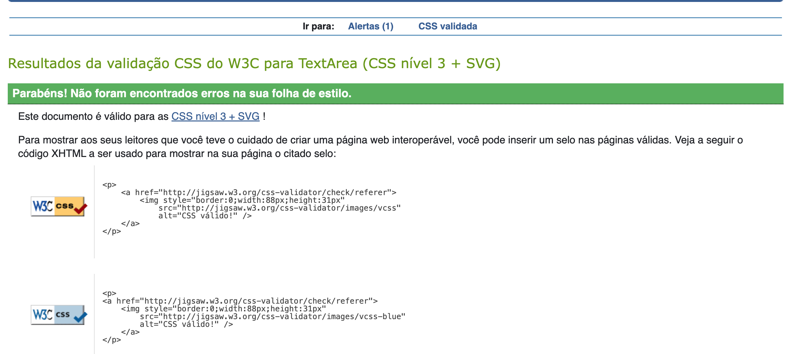

# BookVerse Testing

## Validation Testing

### Python Linter Validation

[CI Python Linter](https://pep8ci.herokuapp.com) was used to validate all my Python files.

CI Python Linter validation Table

| File | Results | Evidenve | 
| --- | --- | --- | 
| **Books** |
| Views | [CI PEP8](https://pep8ci.herokuapp.com/https://raw.githubusercontent.com/jmanager25/book-verse/main/books/views.py) | Pass |
| Urls | [CI PEP8](https://pep8ci.herokuapp.com/https://raw.githubusercontent.com/jmanager25/book-verse/main/books/urls.py) | Pass |
| Serializers | [CI PEP8](https://pep8ci.herokuapp.com/https://raw.githubusercontent.com/jmanager25/book-verse/main/books/serializers.py) | Pass |
| Models | [CI PEP8](https://pep8ci.herokuapp.com/https://raw.githubusercontent.com/jmanager25/book-verse/main/books/models.py) | Pass |
| Apps | [CI PEP8](https://pep8ci.herokuapp.com/https://raw.githubusercontent.com/jmanager25/book-verse/main/books/apps.py) | Pass |
| **Bookverse_api** |
| Views | [CI PEP8](https://pep8ci.herokuapp.com/https://raw.githubusercontent.com/jmanager25/book-verse/main/bookverse_api/views.py) | Pass |
| Urls | [CI PEP8](https://pep8ci.herokuapp.com/https://raw.githubusercontent.com/jmanager25/book-verse/main/bookverse_api/urls.py) | Pass |
| Settings | [CI PEP8](https://pep8ci.herokuapp.com/https://raw.githubusercontent.com/jmanager25/book-verse/main/bookverse_api/settings.py) | Pass |
| Serializers | [CI PEP8](https://pep8ci.herokuapp.com/https://raw.githubusercontent.com/jmanager25/book-verse/main/bookverse_api/serializers.py) | Pass |
| Permissions | [CI PEP8](https://pep8ci.herokuapp.com/https://raw.githubusercontent.com/jmanager25/book-verse/main/bookverse_api/permissions.py) | Pass |
| **Comments** |
| Views | [CI PEP8](https://raw.githubusercontent.com/jmanager25/book-verse/main/comments/views.py) | Pass |
| Urls | [CI PEP8](https://pep8ci.herokuapp.com/https://raw.githubusercontent.com/jmanager25/book-verse/main/comments/urls.py) | Pass |
| Serializers | [CI PEP8](https://pep8ci.herokuapp.com/https://raw.githubusercontent.com/jmanager25/book-verse/main/comments/serializers.py) | Pass |
| Models | [CI PEP8](https://pep8ci.herokuapp.com/https://raw.githubusercontent.com/jmanager25/book-verse/main/comments/models.py) | Pass |
| Apps | [CI PEP8](https://pep8ci.herokuapp.com/https://raw.githubusercontent.com/jmanager25/book-verse/main/comments/apps.py) | Pass |
| **Followers**|
| Views | [CI PEP8](https://pep8ci.herokuapp.com/https://raw.githubusercontent.com/jmanager25/book-verse/main/followers/views.py) | Pass |
| Urls | [CI PEP8](https://pep8ci.herokuapp.com/https://raw.githubusercontent.com/jmanager25/book-verse/main/followers/urls.py) | Pass |
| Serializers | [CI PEP8](https://pep8ci.herokuapp.com/https://raw.githubusercontent.com/jmanager25/book-verse/main/followers/serializers.py) | Pass |
| Models | [CI PEP8](https://pep8ci.herokuapp.com/https://raw.githubusercontent.com/jmanager25/book-verse/main/followers/models.py) | Pass |
| Apps | [CI PEP8](https://pep8ci.herokuapp.com/https://raw.githubusercontent.com/jmanager25/book-verse/main/followers/apps.py) | Pass |
| **Likes** |
| Views | [CI PEP8](https://pep8ci.herokuapp.com/https://raw.githubusercontent.com/jmanager25/book-verse/main/likes/views.py) | Pass |
| Urls | [CI PEP8](https://pep8ci.herokuapp.com/https://raw.githubusercontent.com/jmanager25/book-verse/main/likes/urls.py) | Pass |
| Serializers | [CI PEP8](https://pep8ci.herokuapp.com/https://raw.githubusercontent.com/jmanager25/book-verse/main/likes/serializers.py) | Pass |
| Models | [CI PEP8](https://pep8ci.herokuapp.com/https://raw.githubusercontent.com/jmanager25/book-verse/main/likes/models.py) | Pass |
| Apps | [CI PEP8](https://pep8ci.herokuapp.com/https://raw.githubusercontent.com/jmanager25/book-verse/main/likes/apps.py) | Pass |
| **Profiles** |
| Views | [CI PEP8](https://pep8ci.herokuapp.com/https://raw.githubusercontent.com/jmanager25/book-verse/main/profiles/views.py) | Pass |
| Urls | [CI PEP8](https://pep8ci.herokuapp.com/https://raw.githubusercontent.com/jmanager25/book-verse/main/profiles/urls.py) | Pass |
| Serializers | [CI PEP8](https://pep8ci.herokuapp.com/https://raw.githubusercontent.com/jmanager25/book-verse/main/profiles/serializers.py) | Pass |
| Models | [CI PEP8](https://pep8ci.herokuapp.com/https://raw.githubusercontent.com/jmanager25/book-verse/main/profiles/models.py) | Pass |
| Apps | [CI PEP8](https://pep8ci.herokuapp.com/https://raw.githubusercontent.com/jmanager25/book-verse/main/profiles/apps.py) | Pass |
| Admin | [CI PEP8](https://pep8ci.herokuapp.com/https://raw.githubusercontent.com/jmanager25/book-verse/main/profiles/admin.py)| Pass |
| **Reviews** |
| Views | [CI PEP8](https://pep8ci.herokuapp.com/https://raw.githubusercontent.com/jmanager25/book-verse/main/reviews/views.py) | Pass |
| Urls | [CI PEP8](https://pep8ci.herokuapp.com/https://raw.githubusercontent.com/jmanager25/book-verse/main/reviews/urls.py) | Pass |
| Serializers | [CI PEP8](https://pep8ci.herokuapp.com/https://raw.githubusercontent.com/jmanager25/book-verse/main/reviews/serializers.py) | Pass |
| Models | [CI PEP8](https://pep8ci.herokuapp.com/https://raw.githubusercontent.com/jmanager25/book-verse/main/reviews/models.py) | Pass |
| Apps | [CI PEP8](https://pep8ci.herokuapp.com/https://raw.githubusercontent.com/jmanager25/book-verse/main/reviews/apps.py) | Pass |
| **Saved Books** |
| Views | [CI PEP8](https://pep8ci.herokuapp.com/https://raw.githubusercontent.com/jmanager25/book-verse/main/saved_books/views.py) | Pass |
| Urls | [CI PEP8](https://pep8ci.herokuapp.com/https://raw.githubusercontent.com/jmanager25/book-verse/main/saved_books/urls.py) | Pass |
| Serializers | [CI PEP8](https://pep8ci.herokuapp.com/https://raw.githubusercontent.com/jmanager25/book-verse/main/saved_books/serializers.py) | Pass |
| Models | [CI PEP8](https://pep8ci.herokuapp.com/https://raw.githubusercontent.com/jmanager25/book-verse/main/saved_books/models.py) | Pass |
| Apps | [CI PEP8](https://pep8ci.herokuapp.com/https://raw.githubusercontent.com/jmanager25/book-verse/main/saved_books/apps.py) | Pass |

### W3C CSS Validation

[CSS Jigsaw Validator](https://jigsaw.w3.org/css-validator/) was used to validate all my CSS files.

W3C CSS validation Table

| File | Evidence | Result | 
| --- | --- | --- | 
| App.module.css |  | Pass |
| Avatar.module.css |  | Pass |
| Book.module.css |  | Pass |
| BookCreateForm.module.css |  | Pass |
| BookPage.module.css |  | Pass |
| Button.module.css |  | Pass |
| Comment.module.css |  | Pass |
| CommentCreateForm.module.css |  | Pass |
| ErrorPage.module.css |  | Pass |
| MoreDropdown.module.css |  | Pass |
| NavBar.module.css |  | Pass |
| Profile.module.css |  | Pass |
| ProfilePage.module.css |  | Pass |
| ReviewCreateForm.module.css |  | Pass |
| Reviews.module.css |  | Pass |
| SignInUpForm.module.css |  | Pass |
| StarRating.module.css |  | Pass |

### ESLint Validation 