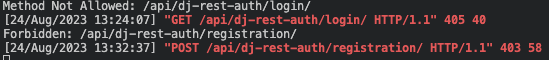
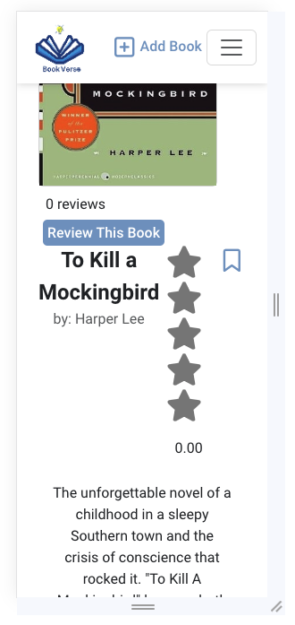

# BookVerse Testing

## Validation Testing

### Python Linter Validation

[CI Python Linter](https://pep8ci.herokuapp.com) was used to validate all my Python files.

CI Python Linter validation Table

| File | Results | Evidenve | 
| --- | --- | --- | 
| **Books** |
| Views | [CI PEP8](https://pep8ci.herokuapp.com/https://raw.githubusercontent.com/jmanager25/book-verse/main/books/views.py) | Pass |
| Urls | [CI PEP8](https://pep8ci.herokuapp.com/https://raw.githubusercontent.com/jmanager25/book-verse/main/books/urls.py) | Pass |
| Serializers | [CI PEP8](https://pep8ci.herokuapp.com/https://raw.githubusercontent.com/jmanager25/book-verse/main/books/serializers.py) | Pass |
| Models | [CI PEP8](https://pep8ci.herokuapp.com/https://raw.githubusercontent.com/jmanager25/book-verse/main/books/models.py) | Pass |
| Apps | [CI PEP8](https://pep8ci.herokuapp.com/https://raw.githubusercontent.com/jmanager25/book-verse/main/books/apps.py) | Pass |
| **Bookverse_api** |
| Views | [CI PEP8](https://pep8ci.herokuapp.com/https://raw.githubusercontent.com/jmanager25/book-verse/main/bookverse_api/views.py) | Pass |
| Urls | [CI PEP8](https://pep8ci.herokuapp.com/https://raw.githubusercontent.com/jmanager25/book-verse/main/bookverse_api/urls.py) | Pass |
| Settings | [CI PEP8](https://pep8ci.herokuapp.com/https://raw.githubusercontent.com/jmanager25/book-verse/main/bookverse_api/settings.py) | Pass |
| Serializers | [CI PEP8](https://pep8ci.herokuapp.com/https://raw.githubusercontent.com/jmanager25/book-verse/main/bookverse_api/serializers.py) | Pass |
| Permissions | [CI PEP8](https://pep8ci.herokuapp.com/https://raw.githubusercontent.com/jmanager25/book-verse/main/bookverse_api/permissions.py) | Pass |
| **Comments** |
| Views | [CI PEP8](https://raw.githubusercontent.com/jmanager25/book-verse/main/comments/views.py) | Pass |
| Urls | [CI PEP8](https://pep8ci.herokuapp.com/https://raw.githubusercontent.com/jmanager25/book-verse/main/comments/urls.py) | Pass |
| Serializers | [CI PEP8](https://pep8ci.herokuapp.com/https://raw.githubusercontent.com/jmanager25/book-verse/main/comments/serializers.py) | Pass |
| Models | [CI PEP8](https://pep8ci.herokuapp.com/https://raw.githubusercontent.com/jmanager25/book-verse/main/comments/models.py) | Pass |
| Apps | [CI PEP8](https://pep8ci.herokuapp.com/https://raw.githubusercontent.com/jmanager25/book-verse/main/comments/apps.py) | Pass |
| **Followers**|
| Views | [CI PEP8](https://pep8ci.herokuapp.com/https://raw.githubusercontent.com/jmanager25/book-verse/main/followers/views.py) | Pass |
| Urls | [CI PEP8](https://pep8ci.herokuapp.com/https://raw.githubusercontent.com/jmanager25/book-verse/main/followers/urls.py) | Pass |
| Serializers | [CI PEP8](https://pep8ci.herokuapp.com/https://raw.githubusercontent.com/jmanager25/book-verse/main/followers/serializers.py) | Pass |
| Models | [CI PEP8](https://pep8ci.herokuapp.com/https://raw.githubusercontent.com/jmanager25/book-verse/main/followers/models.py) | Pass |
| Apps | [CI PEP8](https://pep8ci.herokuapp.com/https://raw.githubusercontent.com/jmanager25/book-verse/main/followers/apps.py) | Pass |
| **Likes** |
| Views | [CI PEP8](https://pep8ci.herokuapp.com/https://raw.githubusercontent.com/jmanager25/book-verse/main/likes/views.py) | Pass |
| Urls | [CI PEP8](https://pep8ci.herokuapp.com/https://raw.githubusercontent.com/jmanager25/book-verse/main/likes/urls.py) | Pass |
| Serializers | [CI PEP8](https://pep8ci.herokuapp.com/https://raw.githubusercontent.com/jmanager25/book-verse/main/likes/serializers.py) | Pass |
| Models | [CI PEP8](https://pep8ci.herokuapp.com/https://raw.githubusercontent.com/jmanager25/book-verse/main/likes/models.py) | Pass |
| Apps | [CI PEP8](https://pep8ci.herokuapp.com/https://raw.githubusercontent.com/jmanager25/book-verse/main/likes/apps.py) | Pass |
| **Profiles** |
| Views | [CI PEP8](https://pep8ci.herokuapp.com/https://raw.githubusercontent.com/jmanager25/book-verse/main/profiles/views.py) | Pass |
| Urls | [CI PEP8](https://pep8ci.herokuapp.com/https://raw.githubusercontent.com/jmanager25/book-verse/main/profiles/urls.py) | Pass |
| Serializers | [CI PEP8](https://pep8ci.herokuapp.com/https://raw.githubusercontent.com/jmanager25/book-verse/main/profiles/serializers.py) | Pass |
| Models | [CI PEP8](https://pep8ci.herokuapp.com/https://raw.githubusercontent.com/jmanager25/book-verse/main/profiles/models.py) | Pass |
| Apps | [CI PEP8](https://pep8ci.herokuapp.com/https://raw.githubusercontent.com/jmanager25/book-verse/main/profiles/apps.py) | Pass |
| Admin | [CI PEP8](https://pep8ci.herokuapp.com/https://raw.githubusercontent.com/jmanager25/book-verse/main/profiles/admin.py)| Pass |
| **Reviews** |
| Views | [CI PEP8](https://pep8ci.herokuapp.com/https://raw.githubusercontent.com/jmanager25/book-verse/main/reviews/views.py) | Pass |
| Urls | [CI PEP8](https://pep8ci.herokuapp.com/https://raw.githubusercontent.com/jmanager25/book-verse/main/reviews/urls.py) | Pass |
| Serializers | [CI PEP8](https://pep8ci.herokuapp.com/https://raw.githubusercontent.com/jmanager25/book-verse/main/reviews/serializers.py) | Pass |
| Models | [CI PEP8](https://pep8ci.herokuapp.com/https://raw.githubusercontent.com/jmanager25/book-verse/main/reviews/models.py) | Pass |
| Apps | [CI PEP8](https://pep8ci.herokuapp.com/https://raw.githubusercontent.com/jmanager25/book-verse/main/reviews/apps.py) | Pass |
| **Saved Books** |
| Views | [CI PEP8](https://pep8ci.herokuapp.com/https://raw.githubusercontent.com/jmanager25/book-verse/main/saved_books/views.py) | Pass |
| Urls | [CI PEP8](https://pep8ci.herokuapp.com/https://raw.githubusercontent.com/jmanager25/book-verse/main/saved_books/urls.py) | Pass |
| Serializers | [CI PEP8](https://pep8ci.herokuapp.com/https://raw.githubusercontent.com/jmanager25/book-verse/main/saved_books/serializers.py) | Pass |
| Models | [CI PEP8](https://pep8ci.herokuapp.com/https://raw.githubusercontent.com/jmanager25/book-verse/main/saved_books/models.py) | Pass |
| Apps | [CI PEP8](https://pep8ci.herokuapp.com/https://raw.githubusercontent.com/jmanager25/book-verse/main/saved_books/apps.py) | Pass |

### W3C CSS Validation

[CSS Jigsaw Validator](https://jigsaw.w3.org/css-validator/) was used to validate all my CSS files.

W3C CSS validation Table

| File | Evidence | Result | 
| --- | --- | --- | 
| App.module.css |  | Pass |
| Avatar.module.css |  | Pass |
| Book.module.css |  | Pass |
| BookCreateForm.module.css |  | Pass |
| BookPage.module.css |  | Pass |
| Button.module.css |  | Pass |
| Comment.module.css |  | Pass |
| CommentCreateForm.module.css |  | Pass |
| ErrorPage.module.css |  | Pass |
| MoreDropdown.module.css |  | Pass |
| NavBar.module.css |  | Pass |
| Profile.module.css |  | Pass |
| ProfilePage.module.css |  | Pass |
| ReviewCreateForm.module.css |  | Pass |
| Reviews.module.css |  | Pass |
| SignInUpForm.module.css |  | Pass |
| StarRating.module.css |  | Pass |

### ESLint Validation 

I didn't include ESLint validation for React components due to time constraints before the submission deadline. Although ESLint's rules are recognized as best practices, I prioritized functionality over strict adherence in the limited time available. This decision is noted in the README, acknowledging the potential for future improvements in line with ESLint's best practices.

## Bugs

#### Fixed Bugs

During the development of this project I encountered several bugs, below are the main ones:

1 - Error when trying to register a user or login in the application - with the help of a tutor we managed to fix this error, i was using SessionCookies authentication instead of TokenAuthentication. 

2 - Error when trying to deploy the project - Ther was a line of code on my Procfile that shouldn't be there. 

3 - When running the server command the screen would appear white with the following error on the console - I had to comment out the DEV and DEBUG variables.

4 - When deleting a book, the book gets deleted but still appears in the home page - I had to update the book state after successfull deletion. setBooks((prevBooks) => prevBooks.filter((book) => book.id !== selectedBookId)).

5 - "Warning: Can't perform a React state update on an unmounted component. This is a no-op, but it indicates a memory leak in your application. To fix, cancel all subscriptions and asynchronous tasks in a useEffect cleanup function" - I implemented the folowing solution:

#### Unfixed Bugs

While testing, I found some issues in the project that I couldn't fix right away. I'll work on solving these problems in future updates.

1 - After deleting a review, the book average rating doesn't get update until the page is refreshed.

2 - When I click on the avatar within the review component, I'm redirected to the profile page. However, not all the data for that user is fetched from the API, and in the search bar, I see https://book-verse-4f0fa583e0ff.herokuapp.com/profiles/undefined.

## Lighthouse

I conducted testing on all the website pages using Lighthouse testing. The primary concern identified was related to the website's performance, largely attributed to the usage of images.

### Home Page

### My Books Page

### Profile Page

### Add Book Page

### Review Create Page

### Sign In Page

### Sign Up Page

## Manual Testing 

### Responsiveness

I tested the website's responsiveness on various devices using developer tools, ranging from small screens like smartphones to larger ones such as desktop monitors. The website is fully responsive on all devices, as confirmed by the screenshots below, showcasing its appearance across different screen sizes. Although the website functions well on most screens, I did encounter some issues on mobile screens. 

#### Mobile Screens 

#### Tablet Screens 

#### Laptop Screens

#### Desktop Screens 

